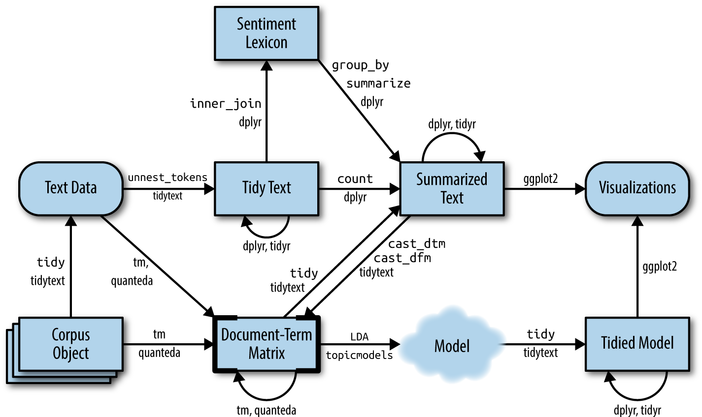

**Tekstualna analiza** je postupak obrade i analize tekstualnih podataka kako bi se izvukli korisni obrasci, informacije i uvidi. Cilj je strukturirati neuređeni tekstualni sadržaj u oblik prikladan za analizu. Ova metoda često uključuje korake poput čišćenja podataka, pretvaranja teksta u numeričke vrijednosti i primjene statističkih i lingvističkih metoda te metoda strojnog učenja za interpretaciju podataka.

Tekstualna analiza uključuje sljedeće korake:

1. Prikupljanje tekstualnog sadržaja iz izvora kao što su društvene mreže, članci, e-pošta, recenzije, itd.

2. Predobrada, odnosno čišćenje podataka (npr. interpunkcija, zaustavne riječi i brojevi) i pretvaranje teksta u standardizirani format.

3. Razbijanje teksta na manje dijelove, poput riječi ili rečenica - tokena.

4. Pretvaranje teksta u numeričke formate kao što su vreće riječi, tf-idf ili ugrađivanja riječi.

5. Primjena metoda kao što su analiza sentimenta, klasifikacija, tematsko modeliranje itd.

6. Vizualizacija i interpretacija pomoću grafova, oblaka riječi i sličnih metoda za lakšu interpretaciju.

Tekstualna analiza može se izvoditi u različitim programskim jezicima kao što su R, Python, Java, C++ i Julia.

Tekstualna analiza uključuje razne mjere kojima analizira tekst, primjerice:

- **analiza sentimenta** - identifikacija emocionalnog tona teksta (pozitivan, negativan, neutralan);

- **tf-idf** - mjera važnosti riječi u dokumentu s obzirom na cijeli korpus;

- **tematsko modeliranje** - identificiranje tematskih obrazaca u tekstovima;

- **n-gram analiza** - analiza sekvenci riječi (dvo-grami, tro-grami itd.);

- **NER** - prepoznavanje entiteta poput imena, mjesta i datuma.

Tekstualna analiza tako omogućuje ekstrakciju ključnih informacija iz velikih količina tekstualnih podataka, praćenje stavova i ponašanja korisnika, automatizaciju obrade podataka u raznim industrijama (prepoznavanje prijevara i analiza recenzija), donošenje informiranih poslovnih odluka temeljenih na podacima i slično.

Primjeri aktualnih tekstualnih analiza su:

- analiza sentimenta na društvenim mrežama,

- automatsko sažimanje teksta,

- prepoznavanje dezinformacija i

- customer support.

## `tidytext`

**`tidytext`** je paket u R-u koji implementira princip *tidy data* u analizu teksta. Omogućuje organizaciju tekstualnih podataka u tablični format čime se olakšava primjena metoda analize i vizualizacije. On koristi principe *tidy data* gdje su redci riječi ili tokeni, a stupci metapodaci (npr. dokumenti, učestalost) pri čemu podržava standardne predobradbene korake poput uklanjanja zaustavnih riječi, implementtira tf-idf i analize sentimenta te ima široku integraciju s ostalim R paketima poput `quanteda` i `ggplot2` za napredne analize i vizualizacije.

R za tekstualna analiza koristi razne pakete od kojih su najvažniji:

- **`tm` (Text Mining)** - klasični paket za tekstualnu analizu koji uključuje alate za čišćenje i analizu teksta,

- **`tidytext`** - omogućuje analizu teksta pomoću principa *tidy data* (uređeni podaci),

- **`text2vec`** - fokusiran na učinkovito vektoriziranje teksta i modeliranje,

- **`quanteda`** - brz i fleksibilan alat za analizu teksta i vizualizaciju te

- **`topicmodels`** - specijaliziran za modeliranje tema.

{fig-align="center"}